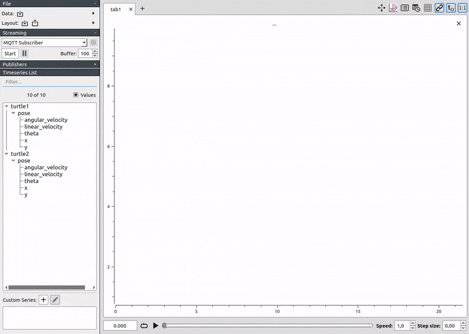
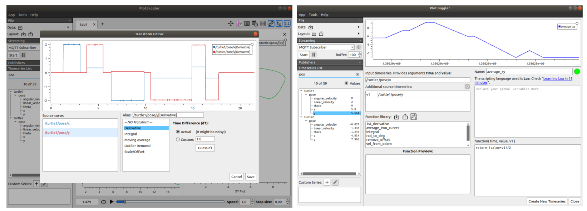

| ROS (Kinetic / Melodic)  | ROS2 (Eloquent) | Windows (Mingw)  |
|---------------------|-----------|-----------|
|  |  |  |

# PlotJuggler 3.0.0

PlotJuggler is a tool to visualize time series that is **fast**, **powerful** and  **intuitive**.

Noteworthy features:

- Simple Drag & Drop user interface.
- Load __static data from file__. 
- Connect to live __streaming__ of data.
- Save the visualization layout and configurations to re-use them later.
- Fast **OpenGL** visualization.
- Can handle **thousands** of timeseries and **millions** of data points.
- Transformations to  the data using a simple editor: derivative, moving average, integral, etc…
- PlotJuggler can be easily extended using __plugins__.

To see what PlotJuggler can do for you, take a look at [this 5 minutes video of PlotJuggler](https://vimeo.com/214389001) 

## Data source (file and streaming)

- Load CSV files.
- Load ULog (PX4).
- Accepts many streaming sources: MQTT, Websockets, ZeroMQ, UDP, etc.
- Understands data formats such as JSON, CBOR, BSON, Message Pack, etc.
- Open Rosbags abd subscribe to ROS topics (both ROS1 and ROS2).
- Easily add your custom data source and formats...

## Transform and analyze your data
PlotJuggler makes it easy to visualize data but also to analyze it.
You can easily manipulate your time series using a simple function editor or a more flexible (but still very intuitive) scripting language based on **Lua**.

## Just "Download and Run" 

On Linux, the simplest way to install PlotJuggler is through **snaps**:

`
    
**Windows Installer**: [PlotJuggler_WIN_Installer-2.8.4.exe](https://github.com/facontidavide/PlotJuggler/releases/download/2.8.4/PlotJuggler_WIN_Installer-2.8.4.exe)

## How to build

Clone the repository as usual:

      git clone https://github.com/facontidavide/PlotJuggler.git

The only binary dependency that you need installed in your system is Qt5. 
On Ubuntu the debians can be installed with the command:

    sudo apt -y install qtbase5-dev libqt5svg5-dev libqt5websockets5-dev libqt5opengl5-dev
    
On Fedora:

    sudo dnf install qt5-qtbase-devel qt5-qtsvg-devel qt5-websockets-devel qt5-qtopendl-devel
    
Then compile using cmake (qmake is NOT supported):

     mkdir build; cd build
     cmake ..
     make
     sudo make install
 
 Note: the plugins need to be installed in the same folder of the executable or in __/usr/local/lib/PlotJuggler/__.

## Note for ROS users

To install PlotJuggler, just type:

    sudo apt install ros-${ROS_DISTRO}-plotjuggler
       
And run it with:

    rosrun plotjuggler PlotJuggler  

Since version 3.x ROS is supported through the plugins that can be found in this repository:

https://github.com/PlotJuggler/plotjuggler-ros-plugins

Refer to the instructions in the latter repository if you want to compile it fromn source.

# If you like PlotJuggler...

PlotJuggler required a lot of work to be developed; my goal is to build the most 
intuitive and powerfull tool to visualize data and timeseries.

If you find PlotJuggler useful, consider making a donation on [PayPal](https://www.paypal.me/facontidavide) or become a 
[Github Sponsor](https://github.com/sponsors/facontidavide).

If you use PlotJuggler at work, your company can support the development of those specific features they need.

[Contact me](https://www.plotjuggler.io/support) for more details.

# Stargazers over time

